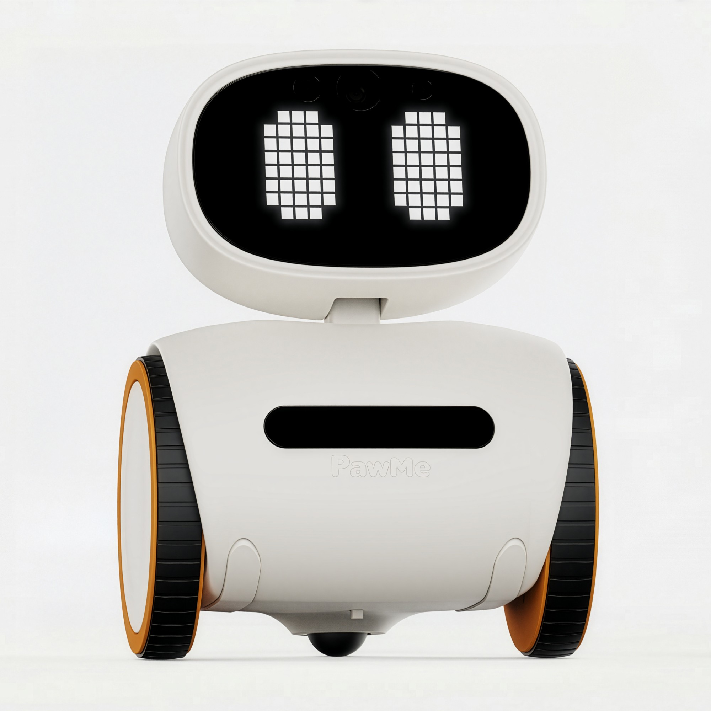
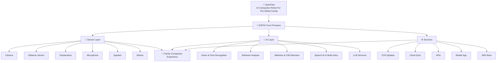

<!-- OpenPaw GitHub README -->

<div align="center">

<!-- ANIMATED HEADER -->


[](https://x.com/OpenPawOfficial)
[](https://reddit.com/user/OpenPawAI)
[](https://linktr.ee/openpawrobot)
[](https://github.com/openpawrobot)

</div>

---

<!-- HERO -->

<h1 align="center">The Little Bot That Cares</h1>

<p align="center">
  
</p>

<p align="center">
  <b>OpenPaw is the open-source AI robot for everyone in your home.</b><br><br>
  It rolls from room to room, looks after your pet while you're at work, keeps an eye on the kids,<br>
  reminds Grandma to take her medicine, helps with homework and recipes,<br>
  and answers questions for the whole family — like ChatGPT on wheels, with eyes that care.<br><br>
  <b>No subscriptions. No walled garden. 100% open source — if you can imagine a skill, you can build it.</b>
</p>

---

<!-- DEMO VIDEO -->

<h2 align="center">🎬 Watch OpenPaw In Action — "You Got This"</h2>

https://github.com/openpawrobotai/main/raw/main/assets/openpaw-you-got-this.mp4

<p align="center">
  🎥 Full demo reel: <a href="https://youtu.be/kn2AgR_2DU8?si=tc3Vv8gAWHyQVW9I"><b>YouTube</b></a> •
  More clips on <a href="https://www.reddit.com/u/OpenPawAI/s/4BdC17TnOp"><b>Reddit</b></a>
</p>

<p align="center">
  🐾 Built in Public • 🤖 Robotics • 🧠 AI • ❤️ Family
</p>

---

<!-- WHY OPENPAW -->
<h2 align="center">❤️ Why OpenPaw Exists</h2>

<p align="center">
Pets spend hours alone. Kids need a patient tutor. Grandparents live far away.<br>
Most "smart home" devices just watch, listen, and lock you in.<br>
<strong>OpenPaw is different — it moves, it sees, it talks, and it belongs to you.</strong>
</p>

<div align="center">

| Typical Smart Home Tech        | OpenPaw                                  |
| :----------------------------- | :--------------------------------------- |
| 👁️ Fixed cameras that just record | 🤖 A robot that roams, finds, and engages |
| 🗣️ One generic assistant voice | 🎭 A different voice & persona per family member |
| 💰 Subscriptions & walled gardens | 🌍 Free, open-source, self-hostable      |
| 📵 Watch-only pet cams         | 🎾 Laser play, treats & two-way comfort   |
| 🚨 No one to check on Grandma  | ❤️ Fall detection, vitals & gentle reminders |
| 🔒 Closed firmware             | 🛠️ Hack it, extend it, ship your own skills |

</div>

---

<!-- WHAT'S INSIDE -->

## 🤖 What's Inside The Little Bot

<div align="center">

| Hardware | What It Enables |
|:---|:---|
| 🛞 **Omnidirectional mobility** | Patrols every room, maps the house, follows the family |
| 😊 **Expressive display** | Emotive eyes, recipe cards, homework hints, video calls |
| 📷 **HD camera + vision AI** | Recognizes faces, finds lost keys, reads worksheets, watches pets |
| 🎤 **Microphones + speaker** | Real-time AI conversation — a different voice for every person |
| 📡 **Distance / LiDAR sensing** | 360° navigation, obstacle avoidance, room mapping |
| 🌡️ **Temperature / IR sensor** | Wellness checks, fall response, environment monitoring |
| 🔴 **Laser pointer** | Pet play sessions, pointing out objects ("your keys are *there*") |
| 📲 **OTA updates + skill store** | The community ships new abilities straight to your robot |

</div>

---

<!-- A DAY WITH OPENPAW -->

## 🏡 A Day With OpenPaw

One robot, every generation of the family:

- 🌅 **Morning patrol** — wakes up, maps the house, checks on everyone (quietly).
- 🔑 **"Where are my keys?"** — vision memory recalls where you left them, then laser-points right at them.
- 🍝 **Recipe coach** — watches your chopping, warns you before the garlic burns, steps you through dinner.
- ➗ **Homework helper** — reads the worksheet, tutors patiently, never just gives away the answer.
- 🧱 **Play buddy** — finds the missing LEGO brick, projects hopscotch grids, referees the games.
- 🐱 **Pet enrichment** — autonomous laser chase for the cat, treats and a familiar voice for an anxious dog.
- 👵 **Grandparent care** — detects a fall, checks temperature, alerts your phone with live video, stays by her side.
- 💊 **Medicine reminders** — gentle nudges at 7 PM sharp, points at the right pill compartment, logs it.
- 🗣️ **Knows everyone** — recognizes each face and switches voice & personality: playful for the kids, calm for Dad, warm and unhurried for Nana.
- 🌙 **Bedtime stories** — installs new skills over the air and projects stars on the ceiling.

> **Open source means imagination is the limit.** Plant-watering reminders, sign-language tutor, karaoke night — if the community can dream it, OpenPaw can learn it.

---

<!-- DEVELOPMENT PROGRESS -->

## 🚀 Development Progress

<div align="center">

| Capability                   |         Status        |
| :--------------------------- | :-------------------: |
| 📷 Camera Streaming          |       ✅ Complete      |
| 🔄 OTA Firmware Updates      |       ✅ Complete      |
| 📡 Distance Sensing          |       ✅ Complete      |
| 🔴 Interactive Laser Module  |       ✅ Complete      |
| 🏗️ Core Firmware Foundation | 🔄 Active Development |
| 🎤 Audio Input System        |     🟡 In Progress    |
| 🔊 Audio Output System       |     🟡 In Progress    |
| 🌡️ Environmental Monitoring |     🟡 In Progress    |
| ⚙️ Motion & Mobility Systems |     🟡 In Progress    |
| 🌐 Device Onboarding & Setup |       ⏳ Planned       |
| 🗣️ Voice Interaction        |       ⏳ Planned       |
| 🧠 Behavior Intelligence     |       ⏳ Planned       |
| ❤️ Wellness Insights         |       ⏳ Planned       |
| 📱 Mobile Application        |       ⏳ Planned       |
| ☁️ Cloud Connectivity        |       ⏳ Planned       |
| 🚀 Production Hardware       |        ⏳ Future       |

</div>

<p align="center">
<b>Current Focus:</b> Firmware Architecture, Audio Systems, Sensor Integration, and Mobility Development
</p>

### Status Legend

* ✅ Complete
* 🔄 Active Development
* 🟡 In Progress
* ⏳ Planned
* 🚀 Future

---

## 🏗️ OpenPaw System Architecture



<!-- TECH STACK -->
## 💻 Technology Stack

<div align="center">

**Firmware**


**Backend & AI**


**Mobile & Frontend**


**DevOps & Tools**


</div>

---

<!-- VERSIONS -->
## 🤖 Hardware Version History

Three generations of the robot, each with full design files (Mechanical / Electrical / Firmware / Design / Docs):

| Version | What It Is | Repo |
|:---|:---|:---|
| **V1** | Spherical self-balancing ball-bot — ESP-ROLL replica (ESP32-CAM) | [openpaw-v1](https://github.com/openpawrobotai/openpaw-v1) |
| **V2** | Custom rolling robot — own mechanicals + custom PCBA, 10-unit batch | [openpaw-v2](https://github.com/openpawrobotai/openpaw-v2) |
| **V3** | Current generation — two-wheeled companion with expressive eyes, camera & sensors | [openpaw-v3](https://github.com/openpawrobotai/openpaw-v3) |

---

<!-- REPOS -->
## 📦 Repository Ecosystem

| Repository | Purpose | Status |
|:---|:---|:---:|
| [🧠 openpaw-firmware](https://github.com/openpawrobotai/openpaw-firmware) | ESP32 Firmware (OTA, gaits, sensors) | 🔄 Active |
| [🔧 openpaw-hardware](https://github.com/openpawrobotai/openpaw-hardware) | PCB, CAD & Mechanical Design | 🔄 Active |
| [⚽ openpaw-ballbot](https://github.com/openpawrobotai/openpaw-ballbot) | ESP32 Self-Balancing Ball Robot | 🔄 Active |
| [🌐 openpaw-website](https://github.com/openpawrobotai/openpaw-website) | Website & Waitlist | 🔄 Active |
| [🤖 openpaw-ml](https://github.com/openpawrobotai/openpaw-ml) | AI Models & Wellness Signals | ⏳ Planned |
| [📚 openpaw-docs](https://github.com/openpawrobotai/openpaw-docs) | Documentation & Architecture | 🔄 Active |
| [📢 openpaw-marketing](https://github.com/openpawrobotai/openpaw-marketing) | Build-In-Public Automation | 🔄 Active |

---

<!-- QUICK START -->
## 🚀 Quick Start

```bash
# Clone the firmware repository
git clone https://github.com/openpawrobotai/openpaw-firmware
cd openpaw-firmware

# Set target and build
idf.py set-target esp32
idf.py build

# Flash to device and monitor
idf.py flash monitor
```

---

<!-- CONTRIBUTING -->
## 🤝 Contributing

We're actively looking for contributors in:

```yaml
roles_needed:
  - 🤖 Robotics Engineers
  - 💻 Embedded / ESP32 Developers
  - 📱 Flutter Developers
  - 🧠 AI / ML Engineers
  - 🔌 PCB / Hardware Designers
  - 🐾 Pet Owners & Families (beta testers!)
  - 🌍 Open Source Contributors
```

**How to contribute:**
1. 🍴 Fork the repository
2. 🌿 Create a feature branch: `git checkout -b feat/amazing-feature`
3. 💾 Commit your changes: `git commit -m 'Add amazing feature'`
4. 📤 Push to branch: `git push origin feat/amazing-feature`
5. 🔀 Open a Pull Request

---

<!-- COMMUNITY -->

## 🌎 Join The OpenPaw Community

<p align="center">
Follow our journey as we build the future of AI family companionship in public.
</p>

<div align="center">

[](https://x.com/OpenPawOfficial)

[](https://reddit.com/user/OpenPawAI)

[](https://youtube.com/@openpaw)

[](https://linktr.ee/openpawrobot)

</div>

<p align="center">
🐾 Development Updates • 🤖 Robotics • 🧠 AI • 🚀 Build In Public
</p>

---

<!-- FOOTER -->
<div align="center">


**🐾 Built in Public by OpenPaw • MIT License • Star ⭐ to support the mission**

*One little robot, looking after the people (and pets) you love — one commit at a time.*

</div>
