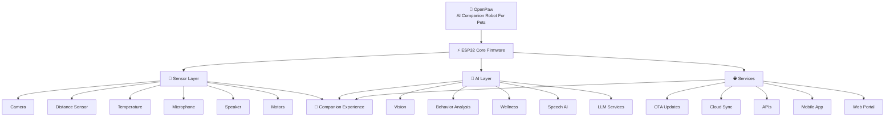

<!-- OpenPaw GitHub README -->
<!-- Copy this to your README.md file -->

<div align="center">

<!-- ANIMATED HEADER -->


<div align="center">

[](https://x.com/OpenPawOfficial)
[](https://reddit.com/user/OpenPawAI)
[](https://linktr.ee/openpawrobot)
[](https://github.com/openpawrobot)

</div>

---
<!-- DEMO SECTION -->

<h2 align="center">🚀 OpenPaw Final Video Cut</h2>

<p align="center">
  <a href="https://www.reddit.com/u/OpenPawAI/s/4BdC17TnOp">
    
  </a>
</p>

<p align="center">
  An AI-powered companion robot designed to keep pets engaged, monitored, and connected while their humans are away.
</p>

<p align="center">
  🎬 <a href="https://youtu.be/kn2AgR_2DU8?si=tc3Vv8gAWHyQVW9I"><b>Watch Full Demo</b></a>
</p>

<p align="center">
  🐾 Built in Public • 🤖 Robotics • 🧠 AI • ❤️ Pets
</p>

---
---

<!-- WHY OPENPAW -->
<h2 align="center">❤️ Why OpenPaw Exists</h2>

<p align="center">
Millions of pets spend hours alone every day.<br>
Most pet cameras only allow owners to watch.<br>
<strong>OpenPaw is different.</strong>
</p>
```

| Traditional Pet Tech          | OpenPaw                           |
| :---------------------------- | :-------------------------------- |
| 👁️ Passive camera monitoring | 🤖 AI-powered interaction         |
| 💰 Proprietary ecosystems     | 🌍 Open-source platform           |
| 📵 Observation only           | 🎾 Engagement & play              |
| 🔒 Closed development         | 🤝 Community-driven innovation    |
| 🚫 Limited insights           | ❤️ Wellness & behavior monitoring |
| 🏠 Device-focused             | 🐾 Pet-focused experience         |

</div>

---


<!-- DEVELOPMENT PROGRESS -->

## 🚀 Development Progress

<div align="center">

| Capability                   |         Status        |
| :--------------------------- | :-------------------: |
| 📷 Camera Streaming          |       ✅ Complete      |
| 🔄 OTA Firmware Updates      |       ✅ Complete      |
| 📡 Distance Sensing          |       ✅ Complete      |
| 🔴 Interactive Laser Module  |       ✅ Complete      |
| 🏗️ Core Firmware Foundation | 🔄 Active Development |
| 🎤 Audio Input System        |     🟡 In Progress    |
| 🔊 Audio Output System       |     🟡 In Progress    |
| 🌡️ Environmental Monitoring |     🟡 In Progress    |
| ⚙️ Motion & Mobility Systems |     🟡 In Progress    |
| 🌐 Device Onboarding & Setup |       ⏳ Planned       |
| 🗣️ Voice Interaction        |       ⏳ Planned       |
| 🧠 Behavior Intelligence     |       ⏳ Planned       |
| ❤️ Wellness Insights         |       ⏳ Planned       |
| 📱 Mobile Application        |       ⏳ Planned       |
| ☁️ Cloud Connectivity        |       ⏳ Planned       |
| 🚀 Production Hardware       |        ⏳ Future       |

</div>

<p align="center">
<b>Current Focus:</b> Firmware Architecture, Audio Systems, Sensor Integration, and Mobility Development
</p>

---

### Status Legend

* ✅ Complete
* 🔄 Active Development
* 🟡 In Progress
* ⏳ Planned
* 🚀 Future

---

## 🏗️ OpenPaw System Architecture



<!-- TECH STACK -->
## 💻 Technology Stack

<div align="center">

**Firmware**


**Backend & AI**


**Mobile & Frontend**


**DevOps & Tools**


</div>

---

<!-- REPOS -->
## 📦 Repository Ecosystem

| Repository | Purpose | Status |
|:---|:---|:---:|
| [🧠 openpaw-firmware](https://github.com/ayvalabs/openpaw-firmware) | ESP32 Firmware | 🔄 Active |
| [🔧 openpaw-hardware](https://github.com/ayvalabs/openpaw-hardware) | PCB, CAD & Mechanical Design | 🔄 Active |
| [📱 openpaw-app](https://github.com/ayvalabs/openpaw-app) | Flutter Mobile Application | ⏳ Planned |
| [🌐 openpaw-website](https://github.com/ayvalabs/openpaw-website) | Website & Waitlist | 🔄 Active |
| [🤖 openpaw-ml](https://github.com/ayvalabs/openpaw-ml) | AI Models & Wellness Signals | ⏳ Planned |
| [📚 openpaw-docs](https://github.com/ayvalabs/openpaw-docs) | Documentation & Architecture | 🔄 Active |
| [📢 openpaw-marketing](https://github.com/ayvalabs/openpaw-marketing) | Build-In-Public Automation | 🔄 Active |

---

<!-- QUICK START -->
## 🚀 Quick Start

```bash
# Clone the firmware repository
git clone https://github.com/ayvalabs/openpaw-firmware
cd openpaw-firmware

# Set target and build
idf.py set-target esp32
idf.py build

# Flash to device and monitor
idf.py flash monitor
```

---

<!-- CONTRIBUTING -->
## 🤝 Contributing

We're actively looking for contributors in:

```yaml
roles_needed:
  - 🤖 Robotics Engineers
  - 💻 Embedded / ESP32 Developers  
  - 📱 Flutter Developers
  - 🧠 AI / ML Engineers
  - 🔌 PCB / Hardware Designers
  - 🐾 Pet Owners (beta testers!)
  - 🌍 Open Source Contributors
```

**How to contribute:**
1. 🍴 Fork the repository
2. 🌿 Create a feature branch: `git checkout -b feat/amazing-feature`
3. 💾 Commit your changes: `git commit -m 'Add amazing feature'`
4. 📤 Push to branch: `git push origin feat/amazing-feature`
5. 🔀 Open a Pull Request

---

 <!-- COMMUNITY -->

## 🌎 Join The OpenPaw Community

<p align="center">
Follow our journey as we build the future of AI-powered pet companionship in public.
</p>

<div align="center">

[](https://x.com/OpenPawOfficial)

[](https://reddit.com/user/OpenPawAI)

[](https://youtube.com/@openpaw)

[](https://linktr.ee/openpawrobot)

</div>

<p align="center">
🐾 Development Updates • 🤖 Robotics • 🧠 AI • 🚀 Build In Public
</p>

---


<!-- FOOTER -->
<div align="center">


**🐾 Built in Public by OpenPaw • MIT License • Star ⭐ to support the mission**

*Building the future of pet companionship, one commit at a time.*

</div>
